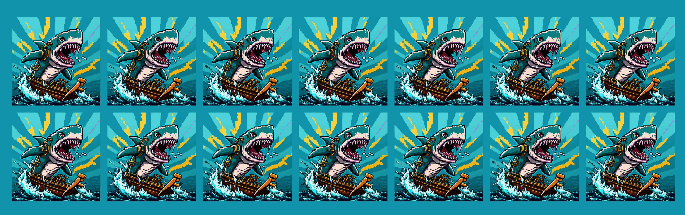

# SharkPunks Collection: multi-chain NFTs on Ethereum, Optimism, Arbitrum, Polygon

SharkPunks, a unique and innovative project that brings together the power of sharks, nature, and finance through the use of non-fungible tokens (NFTs) on the Ethereum blockchain. With a total of 5000 unique pieces, the SharkPunks NFT collection offers proof of ownership for each individual token, ensuring that each one is truly one of a kind.

In addition to its value as a collectible, the SharkPunks NFT collection also has real-world utility, providing access to a range of exciting projects and developments that benefit from the support of the SharkPunks community. Through the use of a decentralized autonomous organization (DAO), the community has the ability to autonomously choose the projects that are eligible for investment rounds, ensuring that the investment opportunities offered by the collection are aligned with the interests and goals of the community.

This repo contains the code for the SharkPunks NFT collection, developed by
[Deepblue Labs](https://deepbluelabs.co).

## Tokenomics

Tokeconomics model for SharkPunks NFT collection.

1. Rarity and exclusivity: SharkPunks NFTs will be highly sought-after due to their rarity and exclusivity.

2. Use case and utility: SharkPunks NFTs offer a clear use case and utility for their holders.

3. Market demand: The overall demand for NFTs, especially in the gaming and art industries, is growing rapidly. 

4. Project performance: The performance of the projects funded by the SharkPunks DAO will also impact the value of the NFTs.

5. Token economics: The SharkPunks NFTs will be sold at different prices during different phases of the distribution process.

### Phases of distribution

1. Phase genesis: NFTs will be sold at 0.1 ETH, 30% of the NFTs will be sold to whitelist members (The SharkPunks Team have a small allocation here).

2. Phase Exodo: NFTs will be sold at 0.15 ETH, 50% of the NFTs will be available for pre-public sale.

3. Phase Final: NFTs will be sold at 0.2 ETH, The remaining 20% of NFTs will be available for public sale

## Conclusion

In conclusion, SharkPunks is a unique NFT collection that offers exclusive access to a decentralized autonomous organization focused on crowdfunding for real-world projects and the crypto industry. With only 5000 total NFTs available, membership in the SharkPunks DAO is highly coveted. Members can contribute capital to carefully curated projects and receive a share of the project's profits in return.

The SharkPunks NFTs offer a clear use case and utility for their holders, including the ability to participate in the voting process and apply their own projects for consideration, as well as access to exclusive airdrops and future collaborations. The rarity, exclusivity, and use case of the NFTs contribute to their value, as well as the overall demand for NFTs in the gaming and art industries.

The SharkPunks solution addresses the challenges and limitations faced by projects in raising capital, particularly those outside of the web 3.0 space. By providing a platform for crowdfunding through a decentralized autonomous organization (DAO), SharkPunks allows projects to tap into a new source of capital and achieve their goals. This is especially important for projects that may not have access to traditional forms of financing, as it gives them a new way to raise the funds they need to succeed. By solving this problem, SharkPunks not only helps individual projects but also promotes economic development and entrepreneurship at a global level.

## More about SharkPunks

- [Website](https://sharkpunks.deepbluelabs.co)
- [Twitter](https://twitter.com/Deepblue_labs)
- [Discord](https://discord.gg/WKZtnCHrpy)
- [Medium](https://deepbluelabs.medium.com/)
- [Docs](https://docs.deepbluelabs.co/sharkpunks)
